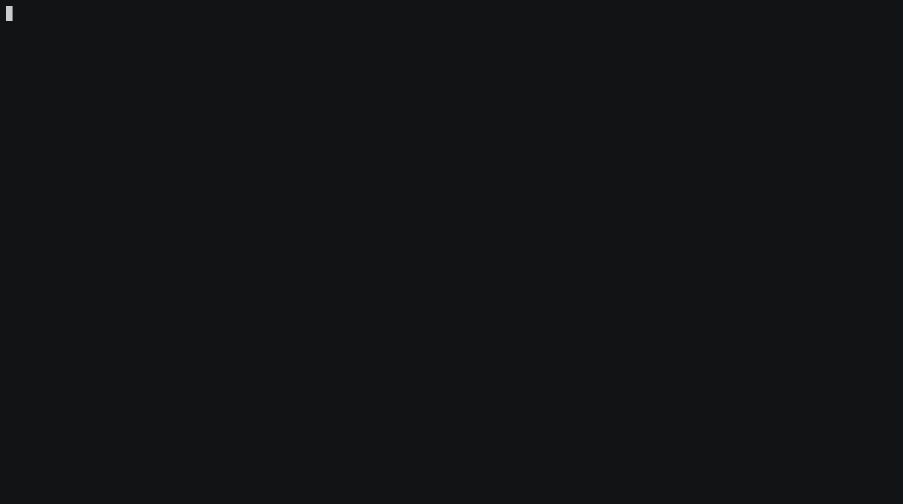

# gesync
`gesync` synchronizes the Guichet Etudiant calendar to Google Calendar

## Requirements

- Python 3.x

## Usage

1. Follow the step 1 found at [Python Quickstart | Google Calendar](https://developers.google.com/calendar/quickstart/python). This will enable the Google Calendar API on the developer console ang give you a credentials.json file.
2. Add the `credentials.json` to the repository's directory.
4. Install the required dependencies: `pip install -r requirements.txt`
5. Initialize the `config.ini` configuration file, by running the `main.py` script once.
```
(venv) $ python main.py
```
6. Run the `main.py` script again. This will insert the events into your previously configured calendar.
```
(venv) $ python main.py
```

## Demo


